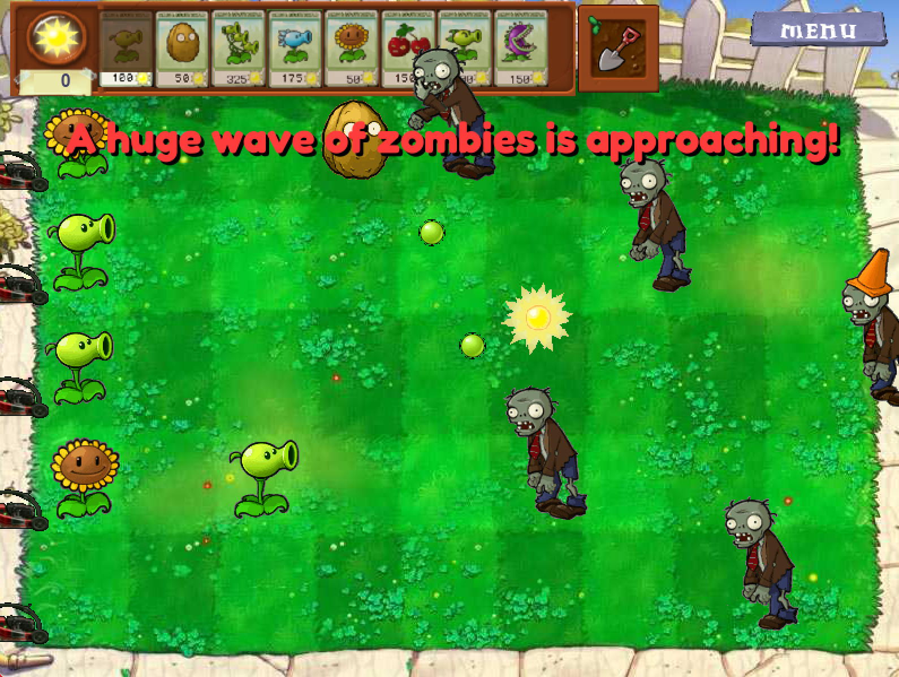
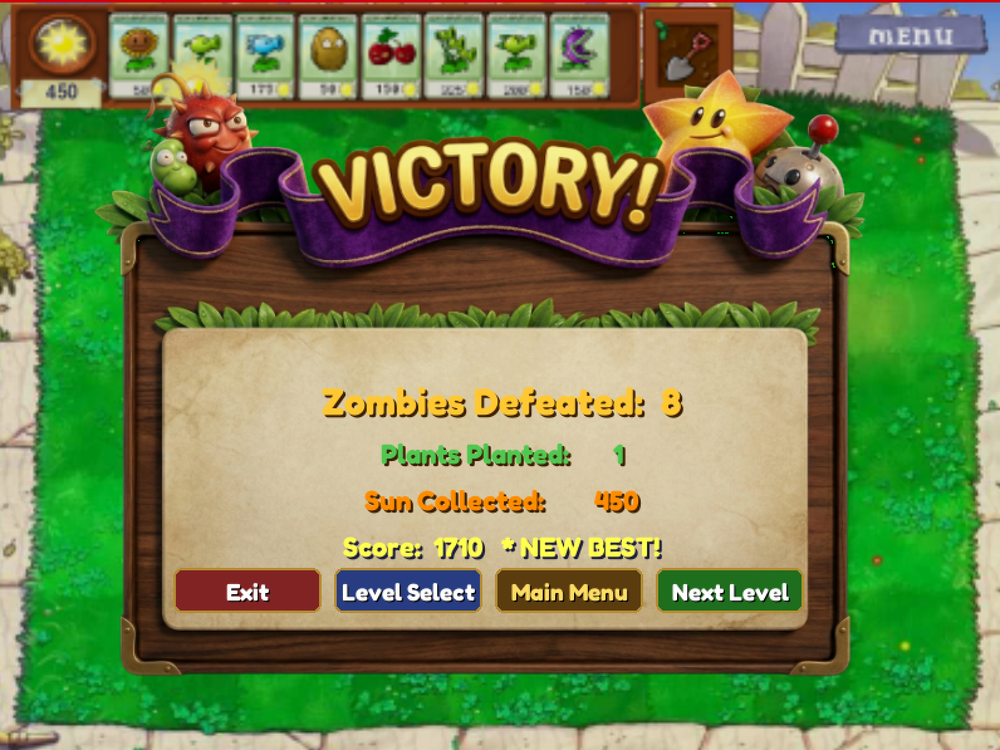
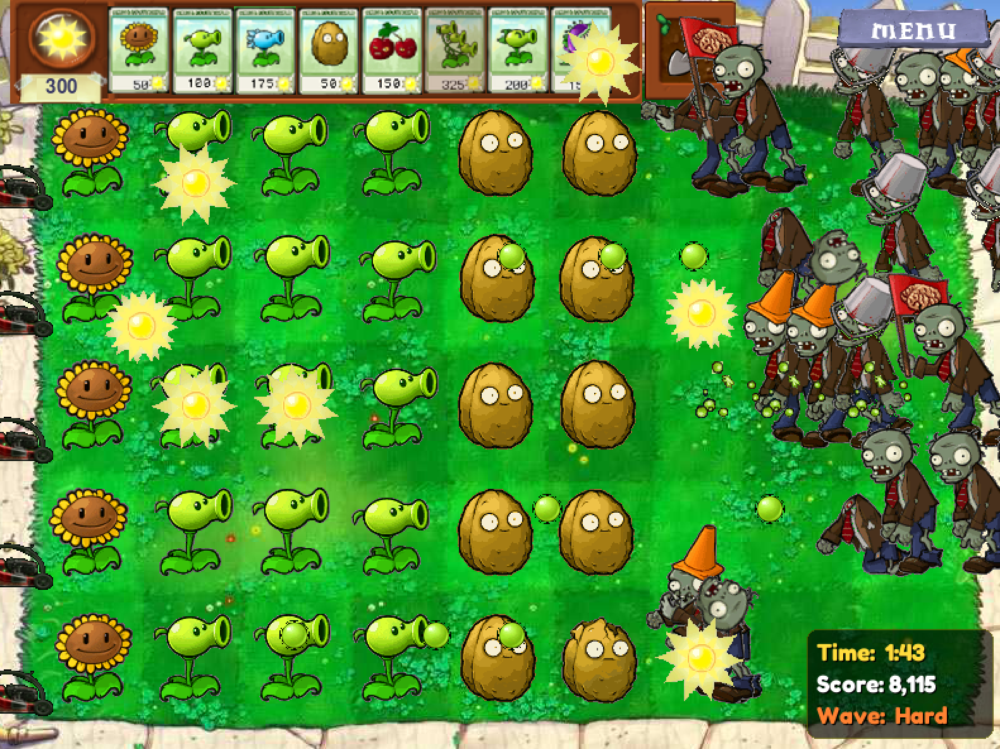

# 🌱🧟 Plants vs. Zombies — Python Edition

> A fully playable Plants vs. Zombies clone built in Python using Pygame.

**Author:** Rao Hamza Bilal &nbsp;|&nbsp; **Language:** Python 3 &nbsp;|&nbsp; **Library:** Pygame &nbsp;|&nbsp; **Screen:** 800 × 600

---

## Screenshots

| Gameplay | Victory | Survival |
|----------|---------|---------|
|  |  |  |

---

## About the Project

This project is a complete recreation of the original Plants vs. Zombies experience, written in Python. It goes well beyond a basic arcade clone — it features a **finite state machine architecture**, a **JSON-driven level engine**, a **persistent player profile system**, and two distinct game modes. Every major computer science concept covered in coursework is demonstrated here: OOP and inheritance, event-driven programming, collision detection, file I/O, data persistence, and UI/UX design.

The codebase spans approximately **5,900 lines** across 20 Python files.

---

## Features

### Two Game Modes

**Adventure Mode**
- 9 handcrafted levels loaded from JSON files
- Difficulty scales across levels — Normal Zombies early, Bucketheads and Newspaper Zombies in later waves
- Wave announcements slide in from the right to warn the player
- Victory screen shows score, personal best flag, and which other players you beat

**Survival Mode**
- Endless — no win condition, survive as long as possible
- 7 escalating phases that increase zombie count, zombie types, spawn speed, and sun drop rate over time
- No card recharge cooldown — plant freely without waiting
- Sun falls significantly faster than Adventure Mode and keeps accelerating
- Separate leaderboard and personal best tracking, completely independent from Adventure scores
- Live HUD displays current time survived, score, and wave difficulty name

### Plants — 18 Types

| Category | Plants |
|----------|--------|
| Sun Producers | Sunflower, Sun-shroom, Puff-shroom |
| Single Shooters | Peashooter, Snow Pea, Repeater, Scaredy-shroom |
| Area Shooters | Threepeater |
| Explosives | Cherry Bomb, Jalapeño, Potato Mine, Squash |
| Defense | Wall-nut, Spikeweed, Chomper |
| Special | Hypno-shroom, Ice-shroom |

### Zombies — 5 Types

| Zombie | Description |
|--------|-------------|
| Normal Zombie | Basic, low health |
| Conehead Zombie | Cone provides medium armour |
| Buckethead Zombie | Bucket provides high armour |
| Flag Zombie | Signals an incoming large wave |
| Newspaper Zombie | Speeds up when newspaper is destroyed |

### Core Systems

- **State Machine** — Every screen is an independent state (`startup → update → cleanup`). Clean transitions, no coupling between screens.
- **JSON Level Engine** — Zombie spawn times, positions, background type, and starting sun are all defined in `level_N.json`. New levels require zero code changes.
- **Player Profiles & Save System** — Multiple profiles supported. Progress, level completion, and scores persist in `save_data.json`. The last used profile loads automatically on startup.
- **Scoring** — `Zombies × 100 + Sun × 2 + Plants × 10` (+ `Seconds × 5` in Survival)
- **Leaderboard** — Ranked tables for Adventure (total score across all levels) and Survival (best single-run score) with cross-profile beat notifications.
- **Tutorial / Hint System** — 9-step animated tutorial on Level 1 for new players. Slides in from the side, highlights UI elements with a pulsing ring, never repeats after completion.
- **Shovel Tool** — Toggle the shovel to remove any planted plant and free its grid cell.
- **Pause Menu** — In-game pause with Back to Game, Restart, Main Menu, and Quit options.
- **Settings Screen** — Reset Tutorial, Toggle FPS Counter, Switch Profile, Delete Scores, Delete Account.

---

## Project Structure

```
main.py
resources/
  fonts/                        Fredoka-Bold.ttf (UI), DWARVESC.TTF (decorative)
  graphics/
    Plants/                     18 plant sprite folders
    Zombies/                    5 zombie sprite folders
    Bullets/                    Projectile sprites
    Cards/                      Plant card images
    Items/                      Sun, lawnmower, shovel, etc.
    Screen/                     UI backgrounds and overlays
source/
  core/
    app.py                      Registers all states and launches the game
    constants.py                All constants, colours, paths, and state names
    engine.py                   Game loop, State base class, image loader
  components/
    map.py                      9×5 grid system
    menu_bar.py                 Card bar, Panel, ShovelTool
    plant.py                    All 18 plant classes (~974 lines)
    zombie.py                   All 5 zombie classes
  states/
    level.py                    Core Adventure gameplay (~910 lines)
    survival.py                 Survival Mode gameplay
    survival_screens.py         Survival Game Over + Survival Leaderboard
    hint_system.py              9-step tutorial for Level 1
    leaderboard.py              Adventure leaderboard screen
    level_select.py             3×3 level selection grid
    main_menu.py                Main menu with personalised user message
    pause_menu.py               In-game pause overlay
    screens.py                  Load, Victory, and Lose screens
    settings.py                 Settings screen
    user_select.py              Profile management and save helpers
  data/
    levels/                     level_1.json through level_9.json
    entities/                   plant.json, zombie.json (sprite rects)
    save_data.json              Player profiles, scores, and progress
```

---

## Game Flow

```
LoadScreen
  ├── profiles exist  →  Main Menu  (auto-loads last profile)
  └── no profiles     →  User Select

Main Menu  →  Adventure (Level Select) | Survival | Leaderboard | Settings | Exit

Level Select  →  Level | Leaderboard | Main Menu
Level         →  Victory | Lose | Pause Menu
Victory       →  Next Level | Level Select | Main Menu | Exit
Lose          →  Retry | Level Select | Main Menu | Exit

Survival          →  Survival Game Over
Survival Game Over →  Retry | Main Menu | Survival Leaderboard | Exit
```

---

## How to Run

**Requires Python 3.7+**

```bash
pip install pygame
```

```bash
cd PythonPlantsVsZombies-master
python main.py
```

---

## Score Formula

```
Adventure Score  =  Zombies × 100  +  Sun Collected × 2  +  Plants Planted × 10
Survival Score   =  Zombies × 100  +  Sun Collected × 2  +  Plants Planted × 10  +  Seconds Survived × 5
```

---

## Architecture Highlights

### Finite State Machine
Every screen is a subclass of `engine.State`. The `Control` class switches between them by calling `startup()` and `cleanup()`. No state has any knowledge of another — all shared data passes through a `persist` dictionary.

### Object-Oriented Design
Plants and zombies use Python class inheritance. `Plant` is the base class; each subclass (`SunFlower`, `PeaShooter`, `CherryBomb`, etc.) overrides only what it needs. Pygame `sprite.Group` collections manage all live entities.

### JSON-Driven Levels
Each level file specifies background type, starting sun, zombie spawn schedule (time + row + type), and wave warning text. Adding a new level means creating one JSON file — no Python changes needed.

### Data Persistence
`save_data.json` stores all player profiles, level progress, per-level Adventure scores, and Survival best scores using Python's built-in `json` module. Profiles auto-load on startup.

---

## Technologies

| Tool | Purpose |
|------|---------|
| Python 3 | Core language |
| Pygame | Rendering, events, sprites, collision |
| JSON | Level data and save data |
| Git / GitHub | Version control |

---
